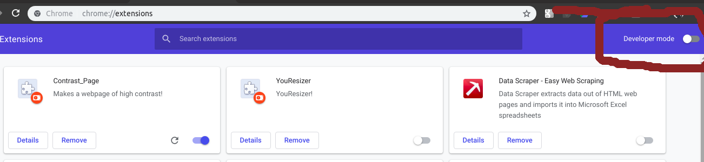
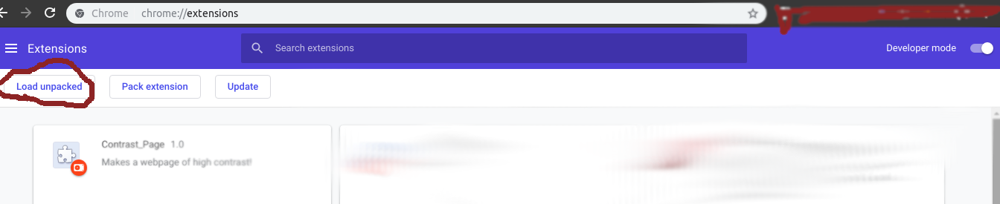

# Color_WebPage (Description)
A google-chrome browser extension that allows to change the colour of background, text and borders of the web-pages.

## Installation
  - Clone or donwload this repository
  - Open extensions tab in google-chrome browser `chrome://extensions`
  - Turn developer mode on if it's not
  - Now click on 'Load unpacked' button and select the folder that you recently cloned / downloaded

